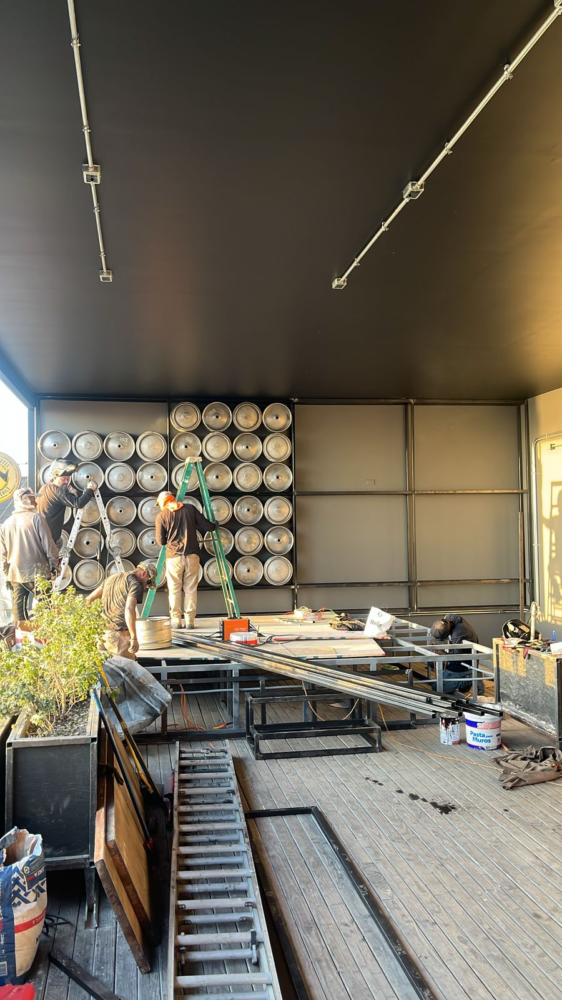

# Espacio Vivo - versión final

## Archivos principales
- `index.html` -> estructura de la página
- `style.css` -> diseño y colores
- `script.js` -> funciones opcionales
- `img/flyer-espacio-vivo.png` -> flyer principal del inicio

## Cómo agregar fotos
Cada proyecto ya tiene sus espacios definidos en el código.

Solo tienes que:
1. Ir a la carpeta `img/proyectos/`
2. Entrar a la carpeta del proyecto correspondiente
3. Pegar las fotos con el mismo nombre que aparece en `index.html`

Ejemplos:
- `img/proyectos/servicios-tribologicos/antes-1.jpg`
- `img/proyectos/servicios-tribologicos/antes-2.jpg`
- `img/proyectos/servicios-tribologicos/despues-1.jpg`

## Importante
Si una foto tiene otro nombre, puedes:
- cambiar el nombre del archivo para que coincida, o
- abrir `index.html` y cambiar el `src` de la imagen

Ejemplo:
```html

```

Si tu foto se llama `crossbar-final.jpeg`, entonces cambias esa línea por:
```html

```

## Cómo verlo
1. Abre la carpeta en VS Code
2. Abre `index.html`
3. Usa Live Preview o abre el archivo en tu navegador
4. Guarda con `Ctrl + S` cada vez que hagas cambios
